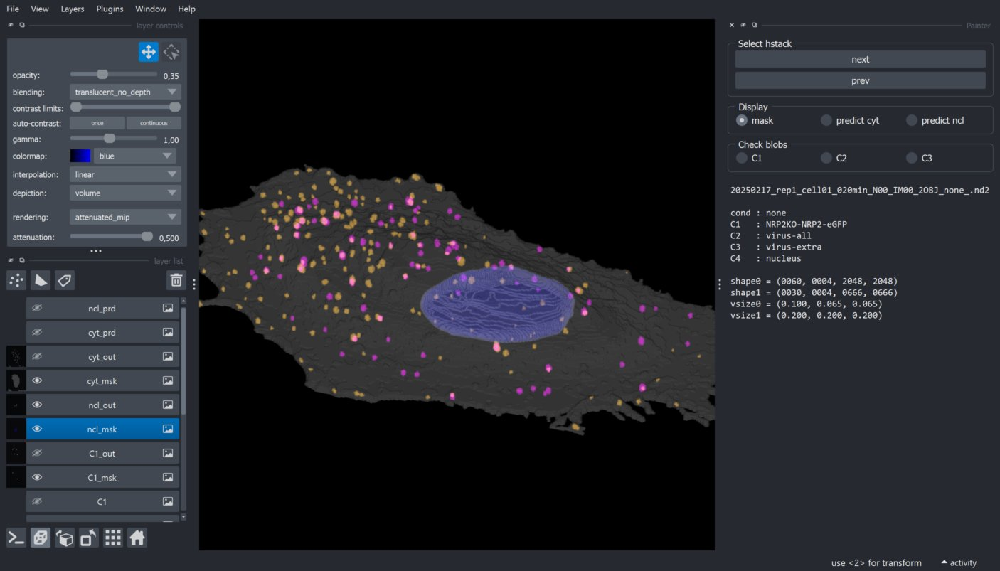

?logo=python&logoColor=rgb(149%2C157%2C165)&labelColor=rgb(50%2C60%2C65))
?logo=TensorFlow&logoColor=rgb(149%2C157%2C165)&labelColor=rgb(50%2C60%2C65))
?logo=NVIDIA&logoColor=rgb(149%2C157%2C165)&labelColor=rgb(50%2C60%2C65))
?logo=NVIDIA&logoColor=rgb(149%2C157%2C165)&labelColor=rgb(50%2C60%2C65))    
&color=rgb(149%2C157%2C165))
&color=rgb(149%2C157%2C165))
&color=rgb(149%2C157%2C165))    

# ETH-ScopeM_Suzuki  
Virus/proteins co-localization analysis

## Index
- [Installation](#installation)
- [Usage](#usage)
- [Comments](#comments)

## Installation

Pease select your operating system

<details> <summary>Windows</summary>  

### Step 1: Download this GitHub Repository 
- Click on the green `<> Code` button and download `ZIP` 
- Unzip the downloaded file to a desired location

### Step 2: Install Miniforge (Minimal Conda installer)
- Download and install [Miniforge](https://github.com/conda-forge/miniforge) for your operating system   
- Run the downloaded `.exe` file  
    - Select "Add Miniforge3 to PATH environment variable"  

### Step 3: Setup Conda 
- Open the newly installed Miniforge Prompt  
- Move to the downloaded GitHub repository
- Run one of the following command:  
```bash
# TensorFlow with GPU support
mamba env create -f environment_tf-gpu.yml
# TensorFlow with no GPU support 
mamba env create -f environment_tf-nogpu.yml
```  
- Activate Conda environment:
```bash
conda activate Suzuki
```
Your prompt should now start with `(Suzuki)` instead of `(base)`

</details> 

<details> <summary>MacOS</summary>  

### Step 1: Download this GitHub Repository 
- Click on the green `<> Code` button and download `ZIP` 
- Unzip the downloaded file to a desired location

### Step 2: Install Miniforge (Minimal Conda installer)
- Download and install [Miniforge](https://github.com/conda-forge/miniforge) for your operating system   
- Open your terminal
- Move to the directory containing the Miniforge installer
- Run one of the following command:  
```bash
# Intel-Series
bash Miniforge3-MacOSX-x86_64.sh
# M-Series
bash Miniforge3-MacOSX-arm64.sh
```   

### Step 3: Setup Conda 
- Re-open your terminal 
- Move to the downloaded GitHub repository
- Run one of the following command: 
```bash
# TensorFlow with GPU support
mamba env create -f environment_tf-gpu.yml
# TensorFlow with no GPU support 
mamba env create -f environment_tf-nogpu.yml
```  
- Activate Conda environment:  
```bash
conda activate Suzuki
```
Your prompt should now start with `(Suzuki)` instead of `(base)`

</details>


## Usage

<p align="left">
  
</p>

### `main_2obj.py`
Main execution code for the "2OBJ" experiments. The code is divided into sub-sections, each of which can be run independently by setting the corresponding procedure boolean flag. However, keep in mind that each sub-section depends on the outputs of the previous one, so they must be executed in order for proper functionality.

#### Procedure

```yml
- extract : bool (0 or 1)
    # read, format and save data from `ND2` files stored in `rmt_path` 
- predict : bool (0 or 1)
    # predict cytoplasmic (cell) & nuclei probabilities using deep learning
- process : bool (0 or 1)
    # generate cytoplasmic, nuclei masks & object labels
- analyse : bool (0 or 1)
    # perform measurments for all & valid (intracell.) C2 objects    
- display : bool (0 or 1)
    # display outputs image stacks in a custom Napari window

```

#### Parameters

```yml
Paths :

    - rmt_path : str 
        # path to remote nd2 files directory
    - loc_path : str 
        # path to local saving directory
    - model_name_cyt : str 
        # name of cytoplasmic model (stored in repo. root)
    - model_name_ncl : str 
        # name of nuclei model (stored in repo. root)
    - save : str ("rmt" or "loc") 
        # save outputs in remote or local directory

Parameters :

    for extract : 

        - voxsize : float 
            # isotropic voxel size after rescaling
    
    for process : 

        - cyt_thresh : float (0 to 1) 
            # thresh. for cytoplasmic prob. predictions
        - ncl_thresh : float (0 to 1) 
            # thresh. for nuclei prob. predictions
        - blb_tcoeffs : list of float
            # thresh. coeff. for C1, C2 & C3 object detection

    for display : 

        - cmaps : list of str 
            # Napari color names for C1, C2, C3 & C4

```

#### Outputs

```yaml
Image stacks :

    from extract : 

        - C1.tif : 3D ndarray (uint8) 
            # iso. rescaled stack of C1
        - C2.tif : 3D ndarray (uint8) 
            # iso. rescaled stack of C2
        - C3.tif : 3D ndarray (uint8) 
            # iso. rescaled stack of C3
        - C4.tif : 3D ndarray (uint8) 
            # iso. rescaled stack of C4

    from predict : 

        - cyt_prd.tif : 3D ndarray (uint8) 
            # cytoplasmic prob. predictions
        - ncl_prd.tif : 3D ndarray (uint8) 
            # nuclei prob. predictions

    from process :

        - cyt_msk.tif : 3D ndarray (uint8) 
            # cytoplasmic mask
        - ncl_msk.tif : 3D ndarray (uint8) 
            # nuclei mask
        - C1_lbl.tif  : 3D ndarray (uint8) 
            # C1 object labels
        - C2_lbl.tif  : 3D ndarray (uint8) 
            # C2 object labels
        - C3_lbl.tif  : 3D ndarray (uint8) 
            # C3 object labels
    
    from analyse : 

        - C2_lbl_v.tif : 3D ndarray (uint8) 
            # valid (intracell.) C2 object labels

CSV files :

    from extract :

        - metadata.csv : CSV file 
            # metadata

    from analyse :

        for each nd2 file
        - C2_results.csv : CSV file 
            # C2 object measurments
        - C2_results_v.csv : CSV file 
            # valid C2 object measurments

        one for all
        - C2_results_m.csv   : CSV file 
            # merged C2 object measurments
        - C2_results_v_m.csv : CSV file 
            # merged valid C2 object measurments

```

#### Results

```yml
- lbl         : int   # C2 object label
- path        : str   # path to associated ND2 file
- date        : str   # experiment date
- rep         : int   # experiment replicate
- cell        : int   # experiment cell
- time        : int   # experiment time (min)
- C1_name     : str   # channel 1 name (acc. to mapping)
- C2_name     : str   # channel 2 name (acc. to mapping)
- C3_name     : str   # channel 3 name (acc. to mapping)
- C4_name     : str   # channel 4 name (acc. to mapping)
- cond        : str   # experiment drug (acc. to mapping)
- exp         : str   # experiment type (2obj or 3obj) 
- count       : int   # C2 object pixel count (volume)
- cyt_edt_avg : float # C2 object avg. distance from cell surface (pixels)
- ncl_msk_avg : float # C2 object avg. value in ncl_msk (0 to 1)
- C1_avg      : float # C2 object avg. value in C1
- C2_avg      : float # C2 object avg. value in C2
- C3_avg      : float # C2 object avg. value in C3
- C1_msk_avg  : float # C2 object avg. value in C1_msk (0 to 1)
- C3_msk_avg  : float # C2 object avg. value in C3_msk (0 to 1)

```

#### Mapping

```yaml
NRP2 :

    - E00 : NRP2KO-eGFP
    - N00 : NRP2KO-NRP2-eGFP
    - N01 : NRP2KO-NRP2-eGFP_T319R
    - N02 : NRP2KO-NRP2-eGFP_AAA
    - N03 : NRP2KO-NRP2-eGFP_dA1A2
    - N04 : NRP2KO-NRP2-eGFP_dB1
    - N05 : NRP2KO-NRP2-eGFP_dB2
    - N06 : NRP2KO-NRP2-eGFP_dMAM
    - N07 : NRP2KO-NRP2-eGFP_dCyto
    - N08 : NRP2KO-NRP2-eGFP_dSA
    - N09 : NRP2KO-NRP2-eGFP_dA1A2B1B2
    - N10 : NRP2KO-NRP2-eGFP_dB1B2
    - N11 : NRP2KO-NRP2-eGFP_dSAB1
    - N12 : NRP2KO-NRP2-eGFP_dSAB1B2
    
- Drugs :

    - IM00 : none
    - Dr01 : DMSO
    - Dr02 : Dyngo4a
    - Dr03 : EIPA
    - Dr04 : Pitstop2
    - Dr05 : CPZ
    
- Channel names : 

    - 2obj  : NRP2, virus-all, virus-extra, nucleus
    - 3obj  : NRP2, virus-all, EEA1, nucleus
```

### `functions.py`
Shared functions.
### `extract.py`
Extract random images for deep learning training.
### `train.py`
Annotate extracted images & train deep learning models.
### `plot_2obj.py`
Plot data from `C2_results_m.csv` & `C2_results_v_m.csv`.


## Comments